# Multi-Task Learning project
Unofficial implementation of: 
Kendall, Alex, Yarin Gal, and Roberto Cipolla. "Multi-task learning using uncertainty to weigh losses for scene geometry and semantics." Proceedings of the IEEE Conference on Computer Vision and Pattern Recognition. 2018.
[[arXiv](https://arxiv.org/abs/1705.07115)].

## Abstract
Numerous deep learning applications benefit from multi-task learning with multiple regression and classification objectives. In this paper we make the observation that the performance of such systems is strongly dependent on the relative weighting between each task’s loss. Tuning these weights by hand is a difficult and expensive process, making multi-task learning prohibitive in practice. We propose a principled approach to multi-task deep learning which weighs multiple loss functions by considering the homoscedastic uncertainty of each task. This allows us to simultaneously learn various quantities with different units or scales in both classification and regression settings. We demonstrate our model learning per-pixel depth regression, semantic and instance segmentation from a monocular input image. Perhaps surprisingly, we show our model can learn multi-task weightings and outperform separate models trained individually on each task.

##  Multi Task Learning with Homoscedastic Uncertainty
The naive approach to combining multi objective losses would be to simply perform a weighted linear sum of the losses for each individual task: 
 

The paper suggest that using Homoscedastic uncertainty can be used as a basis for weighting losses in a multi-task learning problem and produce supirior results then the naive approach.

### Mathematical Formulation
First the paper defines multi-task likelihoods: 
- For regression tasks, likelihood is defined as a Gaussian with mean given by the model output with an observation noise scalar σ: 
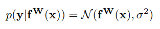 
- For classification, likelihood is defined as: 
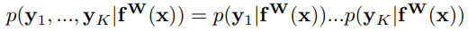 
where: 
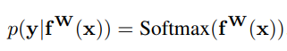 

In maximum likelihood inference, we maximise the log likelihood of the model. In regression for example: 
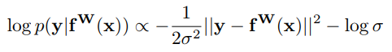 
σ is the model’s observation noise parameter - capturing how much noise we have in the outputs. We then
maximise the log likelihood with respect to the model parameters W and observation noise parameter σ. 

Assuming two tasks that follow a Gaussian distributions: 
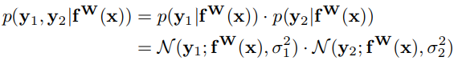 
The loss will be: 
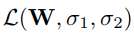 
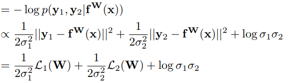 
This means that W and σ are the learned parameters of the network. W are the wights of the network while σ are used to calculate the wights of each task loss and also to regularize this task loss wight.

## Architecture
### Overview
The network consisets of an encoder which produce a shared representation and  followed by three task-specific decoders:
1. Semantic segmantation Decoder.
2. Instance segmantation Decoder.
3. Depth estimation Decoder.

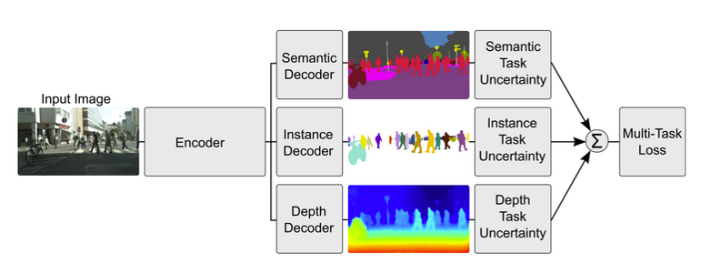

### Encoder
The encoder consisets of a fine tuned pre-trained ResNet 101 v1 with the following chnges:
1. Droped the final fully conected layer.
2. Last layer is resized to 128X256.
3. used Dilated convolutional approch (atrous convolution).

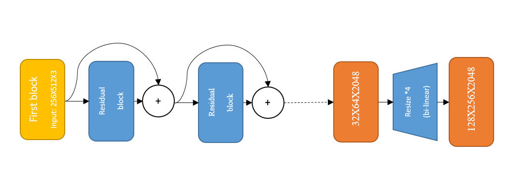

### Atrous convolution
Given an image, we assume that we first have a downsampling operation that reduces the resolution by a factor of 2, and then perform a convolution with a kernel (in the example beneath: the vertical Gaussian derivative). If one implants the resulting feature map in the original image coordinates, we realize that we have obtained responses at only 1/4 of the image positions. Instead, we can compute responses at all image positions if we convolve the full resolution image with a filter ‘with holes’, in which we upsample the original filter by a factor of 2, and introduce zeros in between filter values. Although the effective filter size increases, we only need to take into account the non-zero filter values, hence both the number of filter parameters and the number of operations per position stay constant. The resulting scheme allows us to easily and explicitly control the spatial resolution of neural network feature responses.

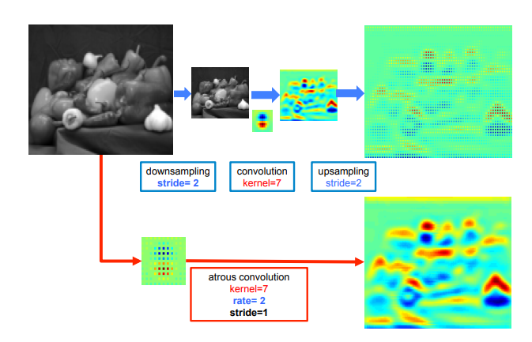

### Decoders
The decoders consisets of three convolution layers:
1. 3X3 Conv + ReLU (512 kernels).
2. 1X1 Conv + ReLU (512 kernels).
3. 1X1 Conv + ReLU (as many kernels as needed for the task).

**Semantic segmantation Decoder:** last layer 34 channels. 
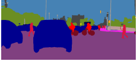

**Instance segmantation Decoder:** last layer 2 channels. 
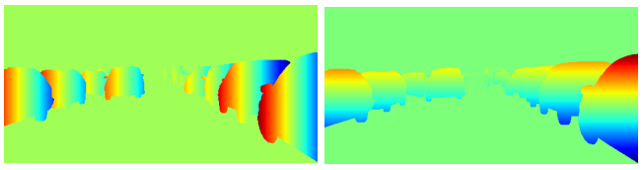

**Depth estimation Decoder:** last layer 1 channel. 

## Losses
### Specific losses
1. Semantic segmantation loss (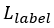): Cross entropy on softMax per pixel (only on valid pixels).
2. Instance segmantation loss (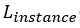): Centroid regression using masked L1. For each instance in the GT we calculate a mask of valid pixels and for each pixel in the mask the length (in pixels) from the mask center (for x and for y) - this will be used as the instance segmantation GT. Then for all valid pixels we calculate L1 between the network output and the instance segmantation GT.
3. Depth estimation loss (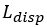): L1 (only on valid pixels).

### Multi loss
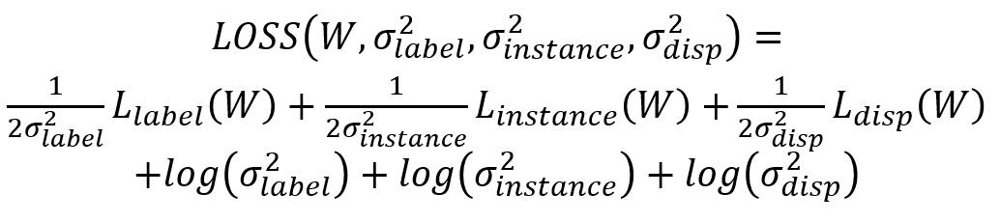

Notice that: 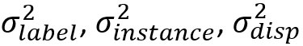 are learnable.

## Instance segmantation explained
The instance segmantation decoder produces two channels so that each pixel is a vector pointing to the instance center. Using the semantic segmantation result we calculate a mask for to calculate the instance segmantation valid pixels. Then we combine the mask and the vectors calculated by the instance segmantation decoder and using the OPTICS clustering algorithem we cluster the vectors to diffrent instances. OPTICS is an efficient density based clustering algorithm. It is able to identify an unknown number of multi-scale clusters with varying density from a given set of samples. OPICS is used for two reasons. It does not assume knowledge of the number of clusters like algorithms such as k-means. Secondly, it does not assume a canonical instance size or density like discretised binning approaches.

## Results
### Examples
|        Input        | Label  segmentation  |Instance  segmentation|       Depth         |
|:-------------------:|:-------------------:|:-------------------:|:-------------------:|
|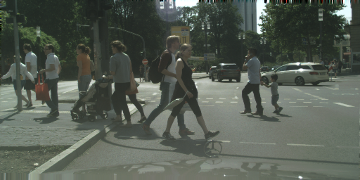|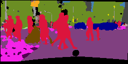|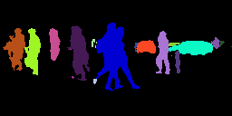|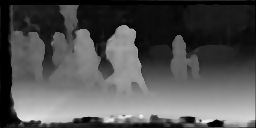|
|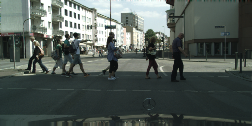|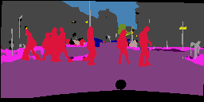|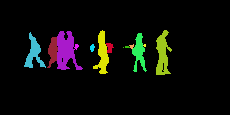|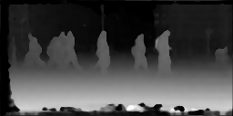|
|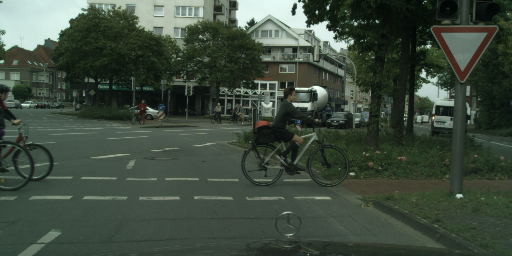|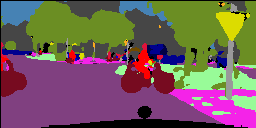|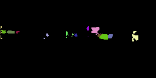|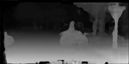|
|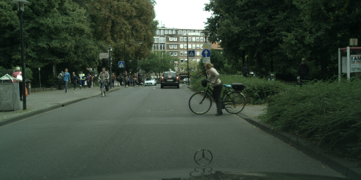|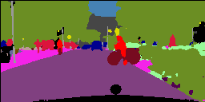|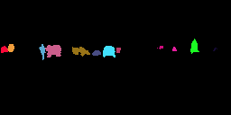|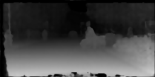|
||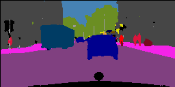|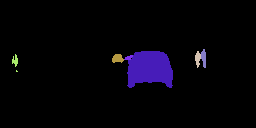|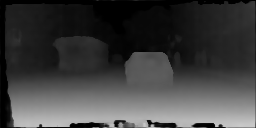|
|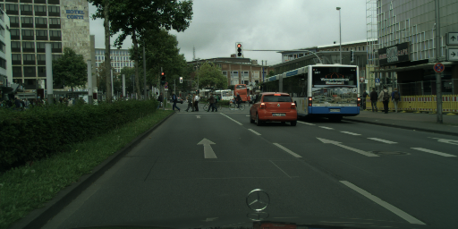||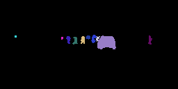|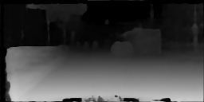|
|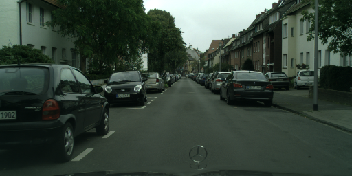|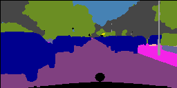||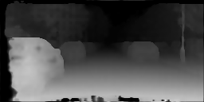|
|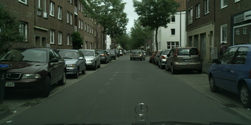|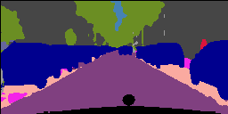||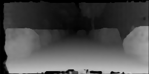|
|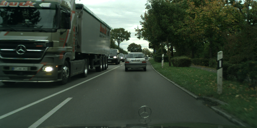|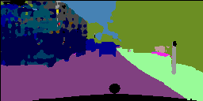||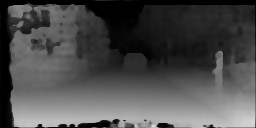|
|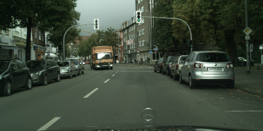|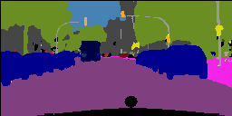|||

### Single vs. Dual vs. All
**Task quantitative result per epoch** 

|Label segmentation   |Instance segmentation|       Depth         |
|:-------------------:|:-------------------:|:-------------------:|
||||

**Comparison to paper quantitative results**  

|                            |     |        |      |Label segmentation   |Instance segmentation|       Depth         |
|----------------------------|:---:|:------:|:----:|:-------------------:|:-------------------:|:-------------------:|
|loss                        |Label|Instance|Depth |IoU [%] (ours/*papers*)|RMS error (ours/*papers*)|RMS error (ours/*papers*)|
|Label only                  |✓    |✗       |✗     |43.45/*43.1*        |✗                   |✗                    |
|Instance only               |✗    |✓       |✗     |✗                  |3.4128/*4.61*        |✗                    |
|Depth only                  |✗    |✗       |✓     |✗                  |✗                    |0.7005/*0.783*       |
|Unweighted sum of losses    |0.333|0.333    |0.333 |*43.6*              |*3.92*               |*0.786*              |
|Approx. optimal weights     |0.8  |0.05     |0.15  |*46.3*              |*3.92*               |*0.799*              |
|2 task uncertainty weighting|✓    |✓       |✗     |42.98/*46.5*        |3.3185/*3.73*        |✗                    |
|2 task uncertainty weighting|✓    |✗       |✓     |43.27/*46.2*        |✗                   |0.7118/*0.714*        |
|2 task uncertainty weighting|✗    |✓       |✓     |✗                  |3.2853/*3.54*        |0.7166/*0.744*        |
|3 task uncertainty weighting|✓    |✓       |✓     |42.87/*46.6*        |3.3183/*3.91*        |0.7102/*0.702*        |

Table rows and column explanation: 
- Rows 3 - 11 show results for diffrent networks trained with diffrent combination of losses and tasks.
- Column 1 shows the loss used for the network.
- Columns 2 - 4 show the tasks that were used doring training (✓ - for using the task, ✗ - for not using the task or number for the task weighting whan a constant weighting parameter was used).
- Columns 5 - 7 show results for every task (our results are on the left side of the `/` *paper results are on the right side*, in rows 7 and 8 we show only the papers result).

The table shows the results of 9 netwoks: 
- 1st - 3rd networks were trained with a single task - Label only (semantic segmantation), Instance only (instance segmantation), Depth only (Depth estimation).
- 4th - 5th networks were trained with three tasks but with constant weights for every task loss (column 2-4 show the weighting).
- 6th - 8th networks were trained with two tasks using uncertainty weighting.
- 9th network was trained with three tasks using uncertainty weighting.

## Setup

**Inferene:** 
1. Download the pre-trained network folder ([resNet_label_instance_disp](https://drive.google.com/drive/folders/1gjhkFlxH0OEsOVD1YFaxrM_fWfpH1eEv?ogsrc=32)) and save it in `trained_nets`.
2. Download the pre-trained resNet-101 folder ([res_net_101_ckpt](https://drive.google.com/drive/folders/1gjhkFlxH0OEsOVD1YFaxrM_fWfpH1eEv?ogsrc=32)) and save it in the main project folder.
3. Put yor wanted input images in `inputs`.
4. Run `inference.py`.
4. Your results will be saved in `results`.

